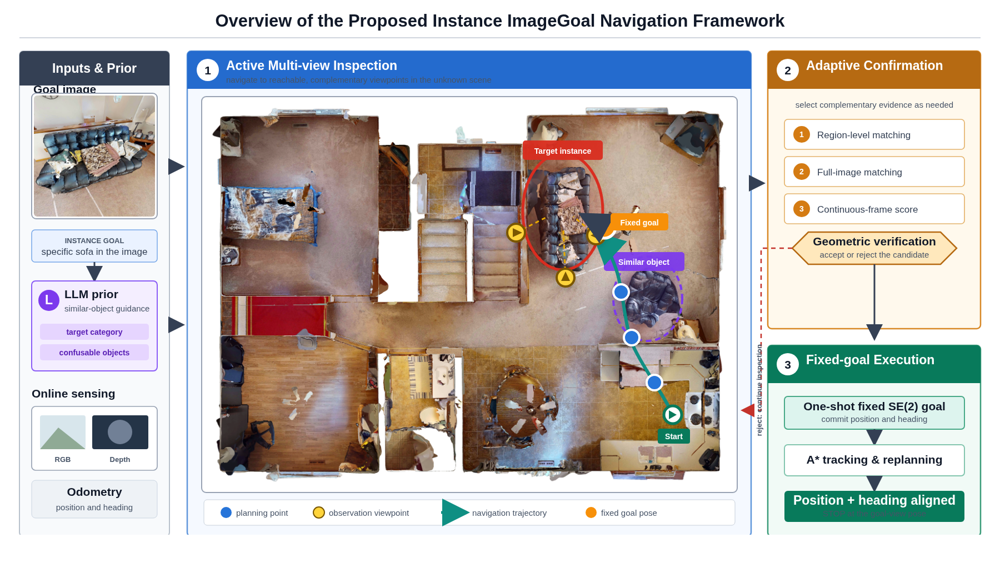
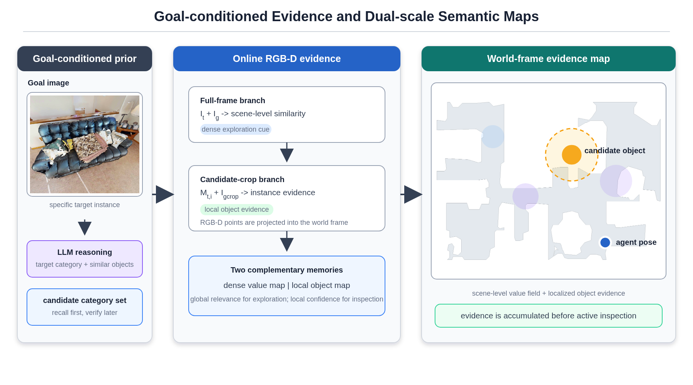
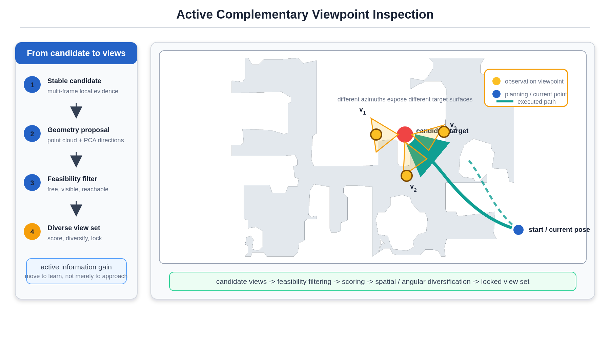
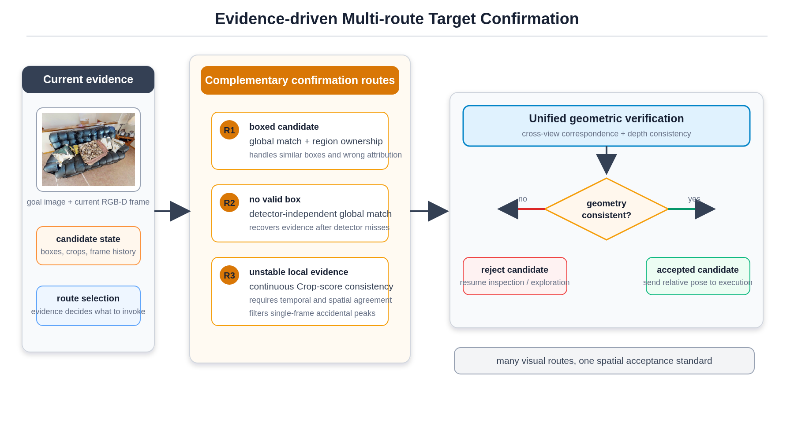
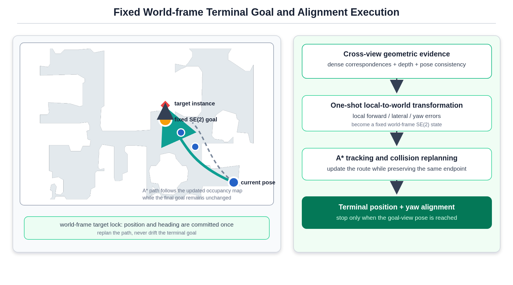

# VantageNav

### Active Multi-View Instance Verification and Goal-Viewpoint Alignment for Zero-Shot Instance ImageGoal Navigation

VantageNav is a training-free framework that actively acquires complementary views of a suspected target, verifies the instance with multiple visual routes, and navigates to the position and heading represented by the goal image.

  
  
  
  

  

## Results at a glance

| Evaluation | Protocol | Result |
| --- | --- | --- |
| Simulation | HM3D InstanceImageNav v3 validation, 1,000 episodes | **72.0% SR**, **31.2% SPL**, **52.52% View Success** |
| Real world | Unitree GO2, four navigation trials | **100% SR**, **53.2% average SPL**, **13.50 m** average travel distance, **158 s** average time |

View Success requires a terminal position error no greater than 0.25 m and a yaw error no greater than 10 degrees. The real-world experiments use a RealSense D435i, 4D LADAR L2, Point-LIO odometry, Kinodynamic A* search, GCopter trajectory generation, and MPC tracking.

Real-world trial breakdown

| Trial | Travel distance (m) | SPL | Time (s) | Position error (m) | Yaw error |
| --- | ---: | ---: | ---: | ---: | ---: |
| Episode 1 | 14.30 | 77.90% | 140 | 0.54 | 10 deg |
| Episode 2 | 18.05 | 36.29% | 253 | 0.37 | 25 deg |
| Episode 3 | 13.02 | 54.04% | 153 | 0.16 | 6 deg |
| Episode 4 | 8.61 | 44.65% | 87 | 0.85 | 5 deg |

## Why VantageNav

- **Goal-conditioned evidence.** The goal image and an LLM-generated set of visually confusable categories provide high recall during candidate discovery. Full-frame similarity drives exploration, while crop similarity is fused into a world-frame candidate map.
- **Active complementary views.** Stable candidates generate observation positions from their fused geometry. Free-space, visibility, path feasibility, distance, and viewing-angle constraints keep only useful viewpoints.
- **Evidence-driven confirmation.** VantageNav selects among region-level matching, detector-independent full-frame matching, and temporally stable evidence. Every route uses the same cross-view geometric quality gate.
- **Fixed goal-viewpoint execution.** Dense correspondences and depth estimate a local relative pose. It is transformed once into a fixed world-frame SE(2) goal, so replanning changes the path without moving the terminal target; final position and yaw are aligned independently.

In the ablation study, removing active inspection lowers SR from 72.0% to 64.6%; removing box-free full-frame confirmation lowers it to 61.5%; removing viewpoint-guided terminal control lowers View Success from 52.52% to 1.10%.

## Video demonstrations

The players below use repository-hosted MP4/WebM files. They are shown with `preload="metadata"` so the page stays light; playback starts when you press play. Each section also includes a direct GitHub file link as a fallback. GitHub may show the native player on the file page when an inline player is unavailable.

### Real-world: complete demo reel

<video controls playsinline preload="metadata" width="100%" src="https://raw.githubusercontent.com/Jin-zhiwen/real_world_display/main/videos/real_world_demo.mp4">
  <source src="https://raw.githubusercontent.com/Jin-zhiwen/real_world_display/main/videos/real_world_demo.mp4" type="video/mp4">
  Your browser does not support inline video. <a href="https://github.com/Jin-zhiwen/real_world_display/blob/main/videos/real_world_demo.mp4">Open the MP4 on GitHub</a>.
</video>

The reel contains successful GO2 trials for plant, air-conditioner, and sink targets, with the goal image, onboard observation, and online map shown together.

### Real-world: individual target clips

<table>
  <tr>
    <td width="33%" align="center">
      <video controls playsinline preload="metadata" width="100%" poster="assets/real_world/plant_goal.png" src="https://raw.githubusercontent.com/Jin-zhiwen/real_world_display/main/videos/plant_navigation.mp4">
        <source src="https://raw.githubusercontent.com/Jin-zhiwen/real_world_display/main/videos/plant_navigation.mp4" type="video/mp4">
        <a href="https://github.com/Jin-zhiwen/real_world_display/blob/main/videos/plant_navigation.mp4">Open the plant clip on GitHub</a>
      </video> 
      <strong>Plant</strong> 
      <a href="https://github.com/Jin-zhiwen/real_world_display/blob/main/videos/plant_navigation.mp4">Open file page</a>
    </td>
    <td width="33%" align="center">
      <video controls playsinline preload="metadata" width="100%" poster="assets/real_world/air_conditioner_goal.png" src="https://raw.githubusercontent.com/Jin-zhiwen/real_world_display/main/videos/air_conditioner_navigation.mp4">
        <source src="https://raw.githubusercontent.com/Jin-zhiwen/real_world_display/main/videos/air_conditioner_navigation.mp4" type="video/mp4">
        <a href="https://github.com/Jin-zhiwen/real_world_display/blob/main/videos/air_conditioner_navigation.mp4">Open the air-conditioner clip on GitHub</a>
      </video> 
      <strong>Air conditioner</strong> 
      <a href="https://github.com/Jin-zhiwen/real_world_display/blob/main/videos/air_conditioner_navigation.mp4">Open file page</a>
    </td>
    <td width="33%" align="center">
      <video controls playsinline preload="metadata" width="100%" poster="assets/real_world/sink_goal.png" src="https://raw.githubusercontent.com/Jin-zhiwen/real_world_display/main/videos/sink_navigation.mp4">
        <source src="https://raw.githubusercontent.com/Jin-zhiwen/real_world_display/main/videos/sink_navigation.mp4" type="video/mp4">
        <a href="https://github.com/Jin-zhiwen/real_world_display/blob/main/videos/sink_navigation.mp4">Open the sink clip on GitHub</a>
      </video> 
      <strong>Sink</strong> 
      <a href="https://github.com/Jin-zhiwen/real_world_display/blob/main/videos/sink_navigation.mp4">Open file page</a>
    </td>
  </tr>
</table>

### Simulation: Habitat / RViz trajectories

<table>
  <tr>
    <td width="50%" align="center">
      <video controls playsinline preload="metadata" width="100%" poster="assets/figures/simulation_episode_09_poster.jpg" src="https://raw.githubusercontent.com/Jin-zhiwen/real_world_display/main/videos/simulation_episode_09.mp4">
        <source src="https://raw.githubusercontent.com/Jin-zhiwen/real_world_display/main/videos/simulation_episode_09.mp4" type="video/mp4">
        <a href="https://github.com/Jin-zhiwen/real_world_display/blob/main/videos/simulation_episode_09.mp4">Play simulation episode 09 on GitHub</a>
      </video> 
      <strong>Episode 09</strong> - exploration, candidate inspection, and terminal alignment
    </td>
    <td width="50%" align="center">
      <video controls playsinline preload="metadata" width="100%" poster="assets/figures/simulation_episode_457_poster.jpg" src="https://raw.githubusercontent.com/Jin-zhiwen/real_world_display/main/videos/simulation_episode_457.mp4">
        <source src="https://raw.githubusercontent.com/Jin-zhiwen/real_world_display/main/videos/simulation_episode_457.mp4" type="video/mp4">
        <a href="https://github.com/Jin-zhiwen/real_world_display/blob/main/videos/simulation_episode_457.mp4">Play simulation episode 457 on GitHub</a>
      </video> 
      <strong>Episode 457</strong> - RGB-D observations, map update, and goal-view execution
    </td>
  </tr>
</table>

Two additional archived RViz recordings are kept in [`videos/`](videos/) for comparison: [recording 1](videos/screen-recording-2026-06-14-22-29-14.webm) and [recording 2](videos/screen-recording-2026-06-14-22-35-11.webm).

## Method in four steps

<table>
  <tr>
    <td width="50%" valign="top">
       
      <strong>1. Goal-conditioned evidence and dual-scale maps.</strong> 
      Full-frame relevance guides where to explore; candidate crops accumulate instance evidence in the world frame.
    </td>
    <td width="50%" valign="top">
       
      <strong>2. Active complementary viewpoint inspection.</strong> 
      Candidate geometry proposes viewpoints that are reachable, visible, and diverse in viewing direction.
    </td>
  </tr>
  <tr>
    <td width="50%" valign="top">
       
      <strong>3. Evidence-driven multi-route confirmation.</strong> 
      Region, full-frame, and temporal routes share one geometric acceptance standard.
    </td>
    <td width="50%" valign="top">
       
      <strong>4. Fixed world-frame terminal goal.</strong> 
      The verified goal-view pose is committed once; A* replanning preserves the endpoint while terminal yaw is aligned.
    </td>
  </tr>
</table>

## Real-world platform

| Component | Configuration |
| --- | --- |
| Robot | Unitree GO2 quadruped |
| Perception | Intel RealSense D435i RGB-D camera; 4D LADAR L2 |
| State estimation | Point-LIO odometry |
| Planning and control | Kinodynamic A*, GCopter/MINCO, MPC, Unitree GO2 SDK |
| Compute | Laptop with NVIDIA RTX 4060 GPU and Intel Core i7-12800HX CPU |
| Camera height | 0.41 m |

## Paper and code

- [Read the VantageNav paper](VantageNav_paper.pdf)
- [Open the implementation repository](https://github.com/Jin-zhiwen/apexuni)
- [Browse all videos and figures](https://github.com/Jin-zhiwen/real_world_display/tree/main)

This repository is the media and project page for VantageNav. The implementation, launch files, configuration, and experiment scripts live in the linked ApexNav repository.

## Limitations

The current system does not correct a biased initial goal-view pose after it has been committed, and it depends on at least one reachable viewpoint with sufficient target visibility. Fully occluded or interaction-dependent targets remain challenging.
